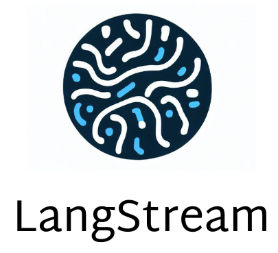

== LangStream AI extension for VSCode

The LangStream project combines the intelligence of large language models (LLMs) with the agility of streaming processing, to create powerful processing applications. An application in LangStream can watch a message topic and process data through multiple steps to output some useful generative AI results.

[TIP]
Get started with the LangStream documentation https://docs.langstream.ai[here].

This extension provides ways to interact with the LangStream API from within VSCode. It provides a simple way to create, update, and delete LangStream applications, modules, and pipeline agents. It also provides a way to view the status of your applications and message with its gateway.

== Installing the extension

=== Visual Studio Marketplace

Visit https://marketplace.visualstudio.com/publishers/DataStax[DataStax page^] in the Visual Studio Marketplace.

=== Direct Download

Visit the https://github.com/riptano/streaming-gen-ai-vscode[releases page^] to download the vsix.

[TIP]
====
For a quick guide on loading .vsix in VScode, https://code.visualstudio.com/docs/editor/extension-marketplace#_install-from-a-vsix[read this^].
====

Once installed you'll notice a new "AI" icon in the activity bar. Click it to activate the extension and see the option to save your control plane.

== Output for debugging

While using the extension you may want to see output of what is going on in the background. To do this, open the VSCode output panel and select the 'LangStream AI' output channel. This will show you the logs from the extension.

== Roadmap of your ideas

We've got high hopes for this extension. If you have an idea of a feature that would make it even better, please open an issue and let's discuss it! You can review the current roadmap in https://github.com/orgs/LangStream/projects/1[the GitHub project].

== Contributing

All contributors are welcome! It helps if you are familiar with Typescript (that's what the extension is written in), but it's not required. If you are interested in contributing, please reach out to us.
